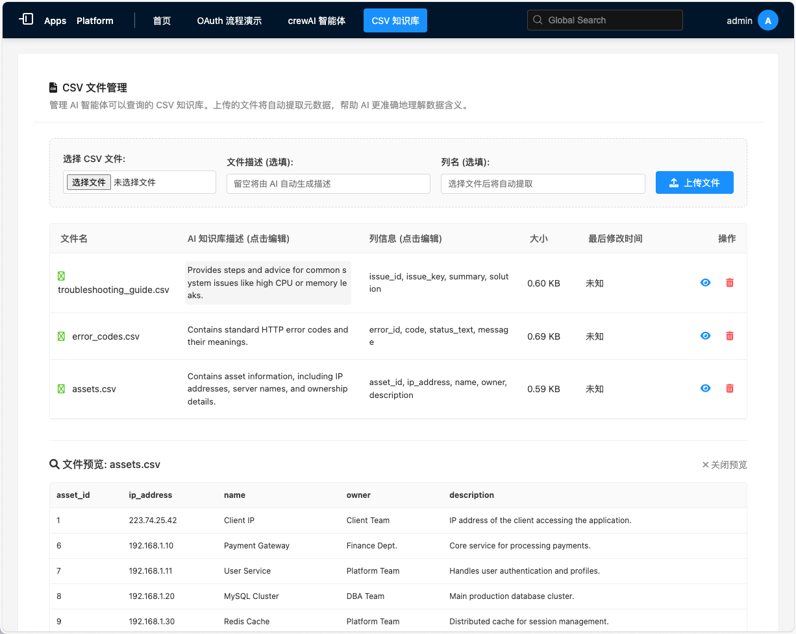
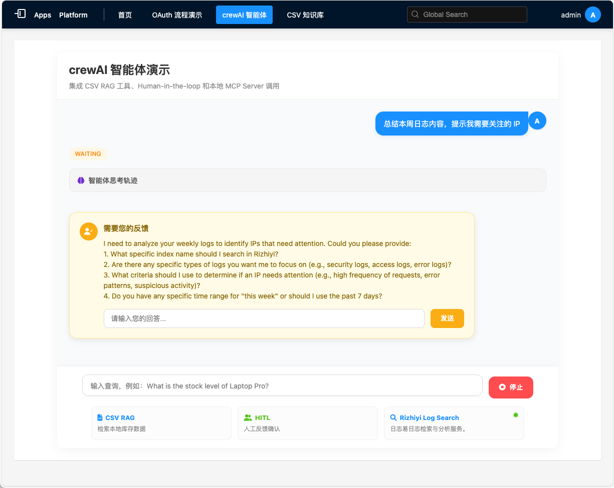

# Rizhiyi Standalone App Demo

这是一个演示如何集成日志易（Rizhiyi）OAuth2.0 授权流程并结合 CrewAI 实现智能日志分析助手的 Django 独立应用示例。

## 项目简介

本项目展示了以下核心功能：
- **OAuth2.0 集成**：完整的第三方应用接入日志易授权流程。
- **智能日志助手**：基于 CrewAI 的 Agent，能够自动搜索日志、查询知识库并协助排查问题。
- **知识库管理**：支持 CSV 格式的资产、错误代码、排障指南等元数据管理。
- **MCP (Model Context Protocol) 联动**：通过 MCP Server 调用日志易 API 进行实时日志检索。
- **现代化 UI**：使用 Django 模板构建的简洁 Web 交互界面。

## 界面预览

### CSV 知识库页面


### CrewAI 对话页面


## 技术栈

- **Web 框架**: Django 5.2.9, Django REST Framework
- **AI Agent**: CrewAI, LangChain, OpenAI/Moonshot LLM
- **数据处理**: Pandas
- **AI 可观测性**: OpenLIT
- **配置管理**: python-decouple, python-dotenv

## 快速开始

### 1. 环境准备

确保已安装 Python 3.10+。建议使用虚拟环境：

```bash
python -m venv venv
source venv/bin/activate  # macOS/Linux
# 或
venv\Scripts\activate  # Windows
```

### 2. 安装依赖

```bash
pip install -r requirements.txt
```

### 3. 配置环境变量

复制 `.env.example` 并重命名为 `.env`，填写相关的配置信息：

```bash
cp .env.example .env
```

主要配置项：
- `RIZHIYI_BASE_URL`: 日志易平台地址
- `CLIENT_ID` / `CLIENT_SECRET`: 日志易第三方应用凭证
- `OPENAI_API_KEY`: LLM API 密钥（如 Moonshot 或 OpenAI）
- `OPENAI_API_BASE`: API 基础地址

### 4. 初始化数据库

```bash
python manage.py migrate
```

### 5. 启动应用

```bash
python manage.py runserver
```

访问 `http://127.0.0.1:8000` 开始体验。

## 核心模块说明

### 1. OAuth 授权 (`oauth/`)
处理与日志易平台的 OAuth2.0 握手流程，获取用户信息及 Token。

### 2. CrewAI 智能助手 (`crewai_agent/`)
- `agent.py`: 定义 Log Analysis Assistant 角色及其任务。
- `tools/`: 包含知识库查询工具和人工交互工具。
- `utils/mcp_utils.py`: 实现与 MCP Server 的连接逻辑。

### 3. 知识库数据 (`data/`)
存放 CSV 文档。并为每个 CSV 文件提取元数据（如列名、可用场景描述等），用于增强 Agent 的背景知识。当 Agent 明确意图时，可以选择文件精确匹配获取内容；而不明确时，通过向量检索全部文档内容。项目中自带了几个演示 CSV 文件，您可以根据实际场景替换或添加新文件。
- `error_codes.csv`: 常见错误代码及含义。
- `assets.csv`: 资产设备信息。
- `troubleshooting_guide.csv`: 排障方案。

## 注意事项

- **MCP Server**: 智能助手的日志搜索功能依赖于[stdio 类型的日志易 MCP Server](https://github.com/rizhiyi/rizhiyi-mcp/)，请确保配置了正确的 `node` 路径和 MCP 服务脚本路径。
- **API Key**: 使用智能助手前，需在 Web 界面中保存您的日志易 API Key。

## License

MIT
